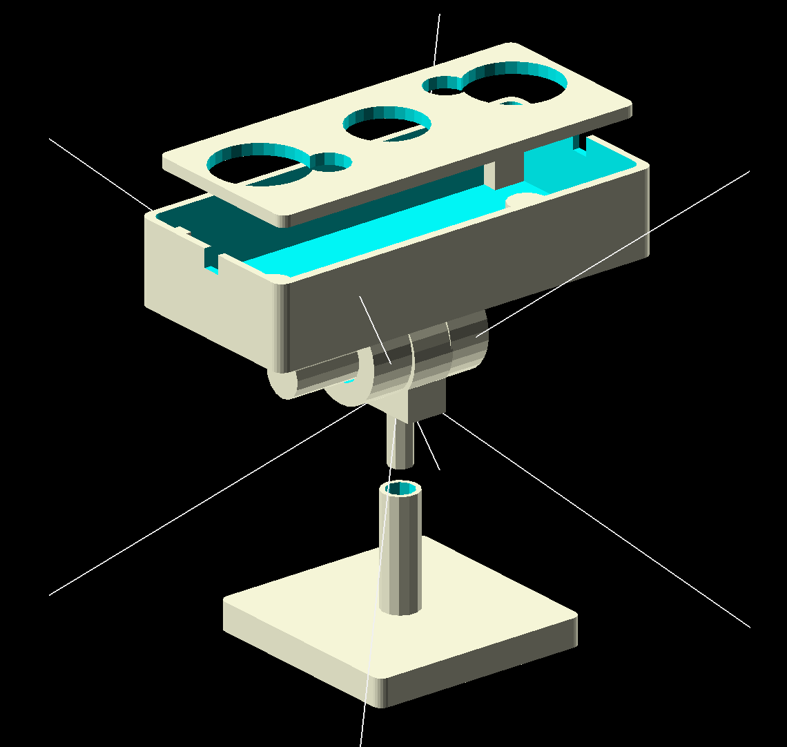
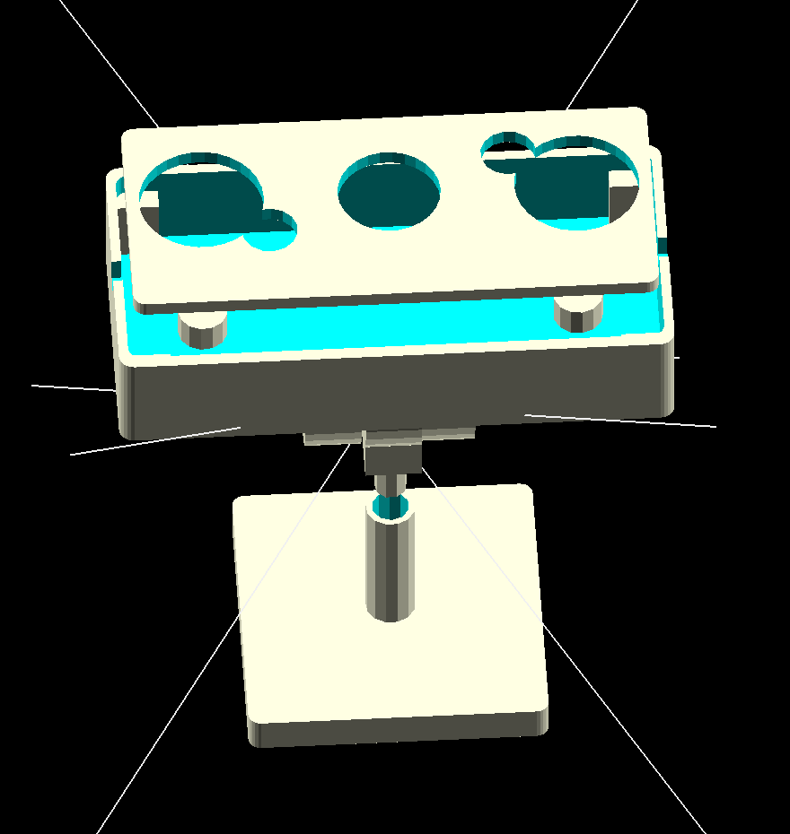

# Raspberry pi night vison case
  by dotnetmobile@gmail.com
---

Different perspectives of the infra red night vision case.

3D printing files are available in the **stl** source code directory.

Use "support" for printing following files:

* step2_foot_rotation_join.stl
* step3_case_with_map.stl

